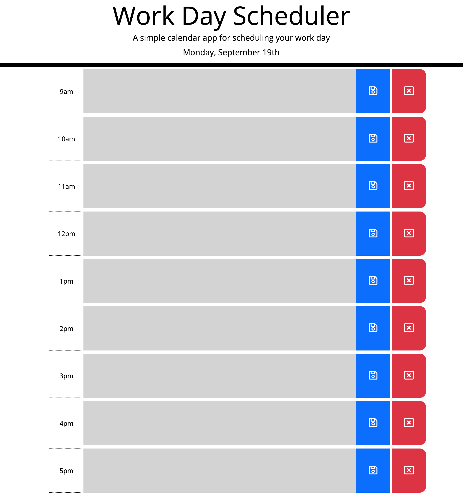

# Challenge 05

## Description

This repo is a tool to help schedule your work day. You can add important events and manage your time effectively with this daily planner. This daily planner uses moment.js, jQuery, and Bootstrap 5.

## Table of Contents

- [Usage] (#usage)
- [Screenshot] (#screenshot)
- [Credits] (#credits)

## Usage

Using the work day scheduler is easy! First, you'll see the current date at the top of the screen. Below are the timeblocks. Each timeblock is color coded:

Red = Current Hour;
Green = Future;
Grey = Past;

To save an event to a timeblock, select the timeblock and enter your event. When finished editing, click on the blue save button. Keep in mind you must enter text in order to save your event to local storage. To clear an event from a specific timeblock, click on the corresponding red delete button. This will remove the current adjacent timeblock from local storage and reset the text area. And if you have one or more events already saved, you can click on the clear all events button to clear ALL events from ALL timeblocks.

## Screenshot

See screenshot below:

## Credits

This daily planner was created by Naveed Mahmoudian.
